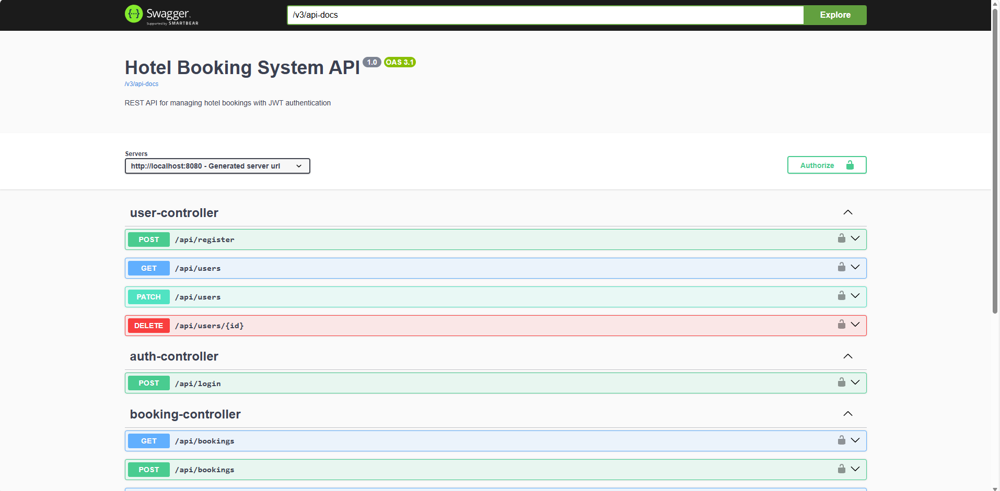
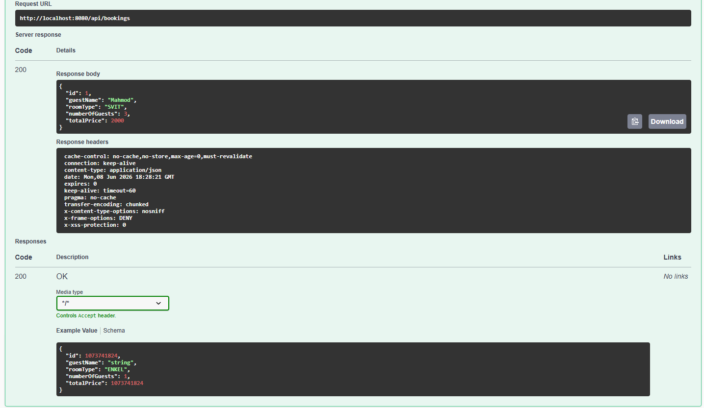
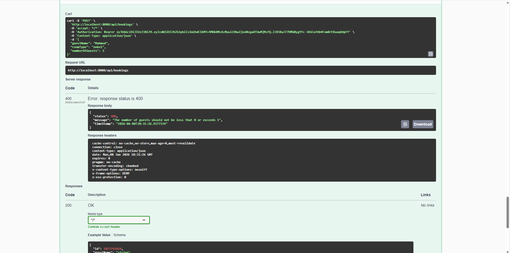
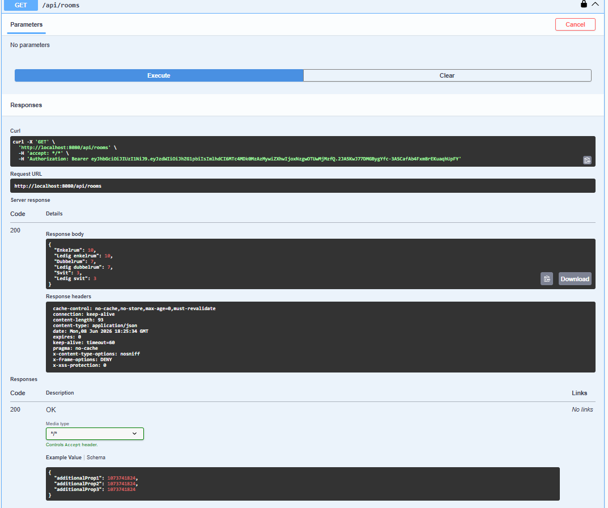

# Hotel Booking System

A REST API for managing hotel bookings, built with Spring Boot and secured with JWT authentication.


## Features

- 🔐 JWT-based authentication with stateless sessions
- 👥 Role-based access control (USER, ADMIN)
- 📝 User registration with BCrypt password hashing
- 🏨 Room booking with capacity and inventory enforcement
- 🚫 Custom exception handling with structured error responses
- ✅ Bean Validation on all incoming requests
- 📖 Auto-generated API documentation via Swagger UI

## Tech Stack

- **Java 21** + **Spring Boot 4**
- **Spring Security** for authentication & authorization
- **Spring Data JPA** + **H2** (in-memory database)
- **JJWT** for token generation/validation
- **Springdoc OpenAPI** for API documentation
- **Maven** for build management

## Architecture

The project follows a layered architecture:

\```
Controller (HTTP layer)
        ↓
Service (Business logic)
        ↓
Repository (Data access)
        ↓
Database (H2)
\```

## API Endpoints

| Method | Endpoint              | Role         | Description           |
|--------|----------------------|--------------|----------------------|
| POST   | /api/login           | Public       | Authenticate, returns JWT |
| POST   | /api/register        | Public       | Create new USER account |
| GET    | /api/rooms           | USER, ADMIN  | View room availability |
| POST   | /api/bookings        | USER, ADMIN  | Create a new booking |
| GET    | /api/bookings        | ADMIN        | List all bookings    |
| DELETE | /api/bookings/{id}   | ADMIN        | Delete a booking     |

## Screenshots

### Swagger UI


### Successful authenticated request


### Structured error response


### Authenticated API Request



## Getting Started

### Prerequisites
- Java 21+
- Maven 3.8+ (or use the included Maven wrapper)

### Run locally
\```bash
git clone https://github.com/mahmod94/BookingsSystem.git
cd BookingsSystem
./mvnw spring-boot:run
\```

The app starts on `http://localhost:8080`.

### Try the API
- **Swagger UI:** http://localhost:8080/swagger-ui.html
- **Pre-seeded admin:** `username: admin` / `password: changeMe123`

## Configuration

| Variable            | Default     | Description                  |
|---------------------|-------------|------------------------------|
| `JWT_SECRET`        | (dev value) | JWT signing secret. **Override in production.** |
| `JWT_EXPIRATION_MS` | 7200000     | Token lifetime (2 hours)     |

## Error Response Format

All errors return a structured JSON response:

\```json
{
    "timestamp": "2026-06-08T18:34:20",
    "status": 400,
    "message": "Number of guests (4) exceeds Enkelrum capacity (1)"
}
\```

## Security Model

- Passwords are hashed with **BCrypt** before storage
- JWT tokens are signed with **HS256** and expire after 2 hours
- All sessions are **stateless** — token is the only auth mechanism
- Role-based access is enforced at the URL pattern level and via `@PreAuthorize`

## What I Learned

- Spring Security configuration and JWT integration
- Custom filter implementation (`OncePerRequestFilter`)
- Layered architecture with clear separation of concerns
- DTO pattern to prevent over-posting attacks (e.g., role injection)
- Bean Validation and centralized exception handling with `@RestControllerAdvice`
- Spring Data JPA derived queries